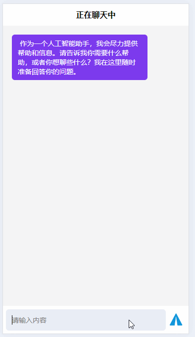

## 效果预览

;

## 项目介绍

Open 将采取额外措施，封禁来自不支持国家和地区的API流量，名单中包括国内。
对此，硅基流动宣布部分顶尖大模型永久免费。

因此我认为会涌入许多个人开发者，所以创建了一个对接硅基流动大模型的模板供参考，该项目对接**SiliconFlow** 的 **Qwen2-7B-Instruct** 语言模型。

该项目前端为 **Uniapp** + 后端 **NodeJs** 搭建

## 项目准备

1. 注册一个账号并登录到[SiliconFlow](https://siliconflow.com/)网站。
2. 申请一个密钥 Token

## 本地部署

1. cd server
2. 创建.env 添加TOKEN
   

3. npm install
4. npm run dev
5. 访问 /send-message?text=xxxxxxxxxxxxx 接口即可
